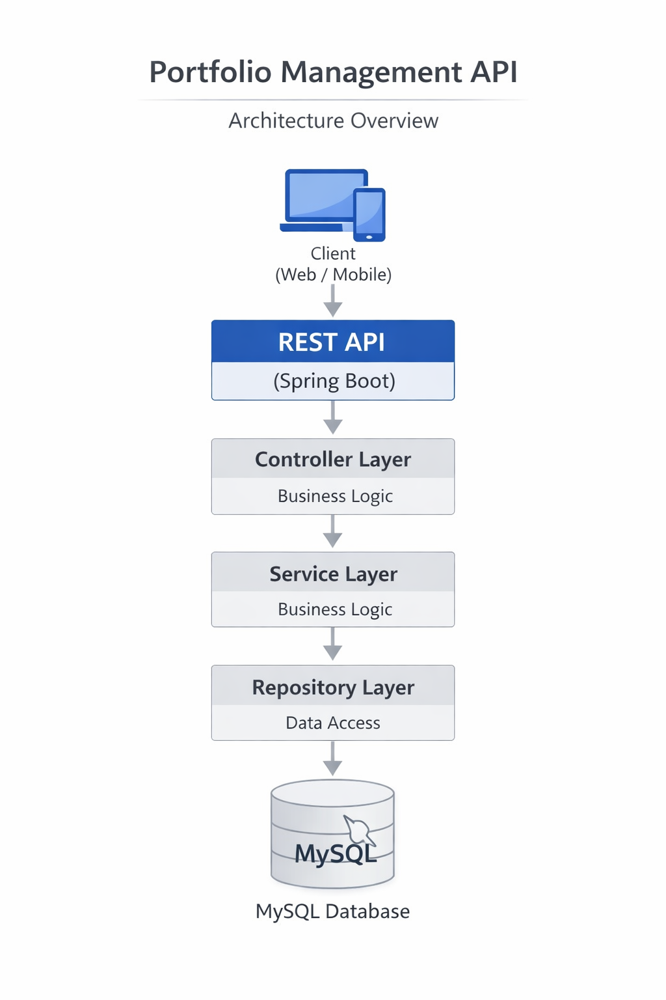
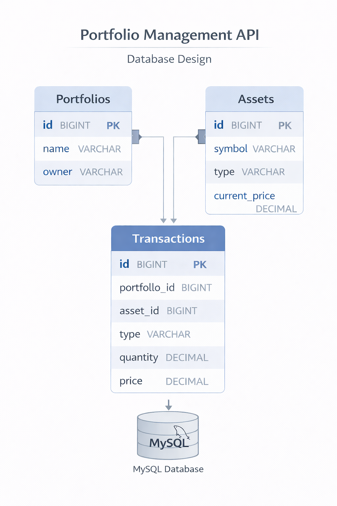

# 📊 Portfolio Management API

A backend system built with **Java and Spring Boot** to manage investment portfolios, assets, and transactions.

This project demonstrates **REST API design, layered architecture, and database integration**, similar to financial backend systems.

---

# 🚀 Tech Stack

| Technology | Purpose |
|-----------|--------|
| Java 17 | Backend language |
| Spring Boot | Application framework |
| Spring Data JPA | Database access |
| Maven | Build tool |
| MySQL | Database |
| REST API | Communication |

---

# 🏗 System Architecture



Architecture Flow:

Client → Controller → Service → Repository → Database

---

# 🔄 Request Flow


1. Client sends request
2. Controller receives request
3. Service processes business logic
4. Repository interacts with database
5. Response returned to client

---

# 📂 Project Structure

```
portfolio-management-api
│
├── src
│   ├── main
│   │   ├── java
│   │   │   └── com
│   │   │       └── example
│   │   │           └── portfolio
│   │   │               ├── controller
│   │   │               │   └── PortfolioController.java
│   │   │               │
│   │   │               ├── service
│   │   │               │   └── PortfolioService.java
│   │   │               │
│   │   │               ├── repository
│   │   │               │   └── PortfolioRepository.java
│   │   │               │
│   │   │               ├── model
│   │   │               │   └── Portfolio.java
│   │   │               │
│   │   │               └── PortfolioApplication.java
│   │
│   └── resources
│       └── application.properties
│
└── pom.xml
```

---

# ⚙ Features

- Create Portfolio
- Add Assets
- Record Transactions
- Track Portfolio Performance
- Transaction History

---

# 🔌 API Endpoints

| Method | Endpoint | Description |
|------|------|------|
| POST | /portfolio | Create portfolio |
| GET | /portfolio/{id} | Get portfolio |
| POST | /transaction | Add transaction |
| GET | /transaction/history | View transactions |

---

# 📦 Example API Request

### Create Portfolio

POST /portfolio

Request

```json
{
 "name": "Retirement Portfolio"
}
```

Response

```json
{
 "id": 1,
 "name": "Retirement Portfolio"
}
```

---

# 🗄 Database Design



Tables:

- Portfolio
- Asset
- Transaction

---

# ▶️ How to Run

Clone repository

```
git clone https://github.com/yourusername/portfolio-management-api
```

Go to project folder

```
cd portfolio-management-api
```

Build project

```
mvn clean install
```

Run application

```
mvn spring-boot:run
```

Server starts on

```
http://localhost:8080
```

---

# 📈 Future Improvements

- Authentication using Spring Security
- Swagger API documentation
- Docker deployment
- Portfolio analytics

---

# 👨‍💻 Author

**Archit Singh**

Backend Developer  
Java | Spring Boot | REST APIs
